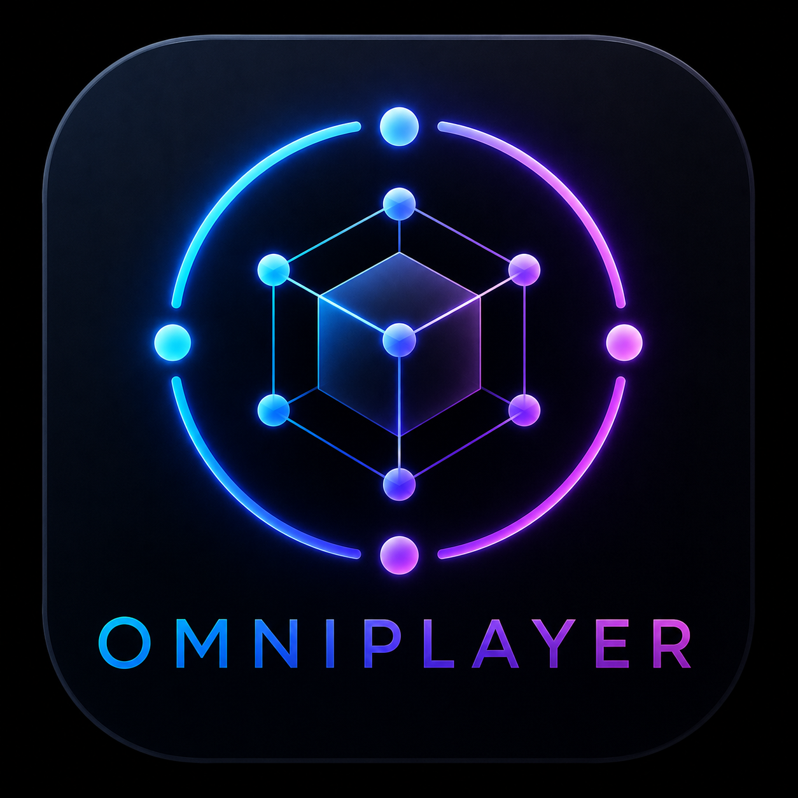
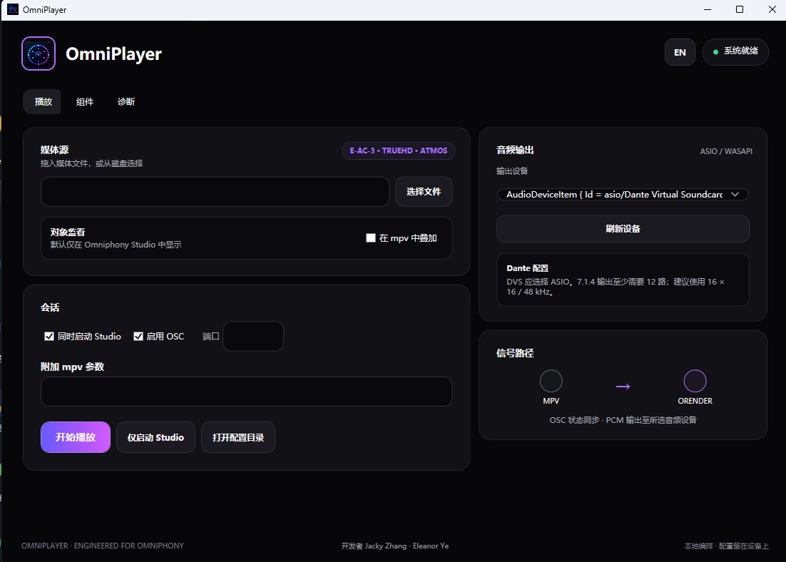

<p align="center">
  
</p>

<h1 align="center">OmniPlayer</h1>

<p align="center">
  A practical Windows workflow for spatial-audio playback, monitoring, and AoIP output.
</p>

OmniPlayer brings **Omniphony Studio**, **mpv-omniphony**, `orender`, and compatible bridge components together as one practical Windows spatial-audio workflow. It reduces the friction of path configuration, multi-process startup, OSC monitoring, and AoIP output through ASIO, giving everyday listeners a clearer route to playing and monitoring supported spatial-audio media.

OmniPlayer 将 **Omniphony Studio**、**mpv-omniphony**、`orender` 与兼容 bridge 组件整合为一套实用的 Windows 空间音频工作流。它解决了路径配置、多进程启动、OSC 监看以及 AoIP 设备通过 ASIO 输出时的操作痛点，让普通用户也能更直观地播放和监听受支持的空间音频媒体。

<p align="center">
  
</p>

> [!IMPORTANT]
> OmniPlayer is an integration, configuration, and launch utility. It is **not a new Dolby or DTS decoder** and does not implement, modify, or reverse-engineer proprietary codec algorithms. Media decoding, playback, bridge, and spatial rendering capabilities are supplied by their independently developed and independently licensed upstream components.

## What it improves / 它解决了什么

- Replaces repeated command-line setup with one visual entry point / 用统一界面替代反复输入命令和启动参数
- Discovers portable or installed runtimes and manages shared paths safely / 自动发现便携或已安装组件，并安全管理共享路径
- Starts mpv-omniphony and Omniphony Studio as one supervised session / 一键启动播放、渲染与 Studio 监看会话
- Keeps object visualization in Studio while disabling the duplicate mpv overlay by default / 默认只在 Studio 中监看对象，避免播放器画面重复叠加
- Exposes ASIO and WASAPI endpoints, including Dante Virtual Soundcard when installed / 支持 ASIO、WASAPI 以及系统中已安装的 Dante Virtual Soundcard
- Makes AoIP workflows easier to route through an ASIO device without bundling or replacing the device driver / 简化 AoIP 接口经 ASIO 输出的配置，但不捆绑或替代声卡驱动
- Protects `config.yaml` changes with timestamped backups / 修改 `config.yaml` 前自动创建带时间戳的备份
- Provides Chinese and English interfaces plus focused runtime diagnostics / 提供中英文界面及面向运行链路的诊断信息

## Signal path / 信号路径

```text
Media file
   │
   ▼
mpv-omniphony ── OSC ──► Omniphony Studio
   │                         │
   └─ compatible bridge ─► orender ─► ASIO / WASAPI / AoIP device
```

The upstream applications remain independently licensed processes. OmniPlayer coordinates their paths, configuration, startup, monitoring, and selected Windows audio endpoint without replacing their native playback or rendering implementations.

## Quick start / 快速开始

1. Download `OmniPlayer-Portable-v1.4.0.zip` from [Releases](https://github.com/zzzzzzjn/OmniPlayer/releases/latest).
2. Extract the entire archive; keep the `runtime/` and `legal/` directories beside `OmniPlayer.exe`.
3. Start `OmniPlayer.exe`, select a media file and the required ASIO/WASAPI endpoint, then choose **Start Playback**.
4. For Dante, install and configure Dante Virtual Soundcard separately, select its ASIO endpoint in OmniPlayer, and patch the required transmit channels in Dante Controller.

## Developers / 开发者

**Jacky Zhang · Eleanor Ye**<br>
Contact / 联系方式: [zjn4576@gmail.com](mailto:zjn4576@gmail.com)

## Credits and thanks / 致谢

OmniPlayer exists because of the work of these projects and their contributors:

- [mgth/Omniphony](https://github.com/mgth/Omniphony) — `liborender`, `orender`, and Omniphony Studio
- [mgth/mpv-omniphony](https://github.com/mgth/mpv-omniphony) — mpv renderer integration, OSC support, and Windows ASIO output
- [harletty/harletty-bridge](https://github.com/harletty/harletty-bridge) — compatible decoder bridge plugin
- [mpv-player/mpv](https://github.com/mpv-player/mpv) — the media-player foundation
- [truehdd/truehdd](https://github.com/truehdd/truehdd) and the decoder contributors credited by harletty-bridge

Thank you to every upstream maintainer and contributor. OmniPlayer claims authorship only of its launcher interface, configuration safeguards, runtime discovery, and process orchestration—not of upstream playback, rendering, bridge, or codec work.

## Build from source

Requirements: Windows and the .NET 8 SDK.

```powershell
dotnet build src/OmniphonyLauncher/OmniphonyLauncher.csproj -c Release
dotnet run --project tests/OmniphonyLauncher.SmokeTests/OmniphonyLauncher.SmokeTests.csproj -c Release
```

To build a local portable aggregate from already installed or downloaded upstream runtimes:

```powershell
powershell -ExecutionPolicy Bypass -File scripts/build-portable.ps1 -Version 1.4.0
```

The packaging script does not download or circumvent licensing for proprietary software. Dante Virtual Soundcard is never bundled; it is detected as an external system driver.

## Releases and licensing

The OmniPlayer launcher source is released under the [MIT License](LICENSE). Portable archives are aggregate distributions in which every bundled upstream binary retains its own license. Keep the archive's `legal/` directory intact when redistributing it. Exact component versions, corresponding-source links, and notices are documented in [legal/SOURCE_AND_LICENSES.md](legal/SOURCE_AND_LICENSES.md).

Names such as Dolby, Dolby Atmos, DTS, Dante, and Audinate may be trademarks of their respective owners and are used only for factual compatibility descriptions. This project is not affiliated with or endorsed by those trademark owners.
